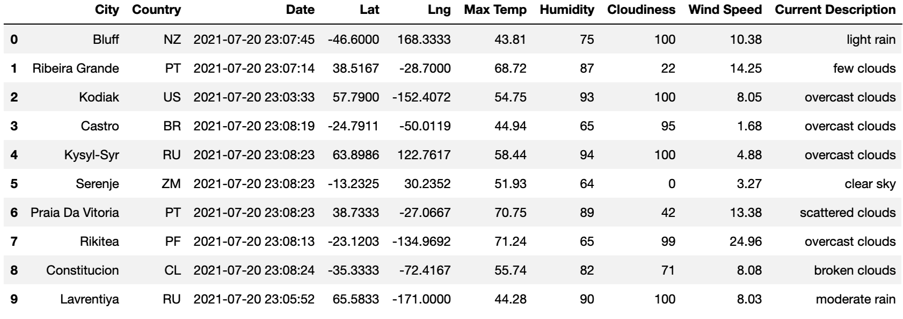
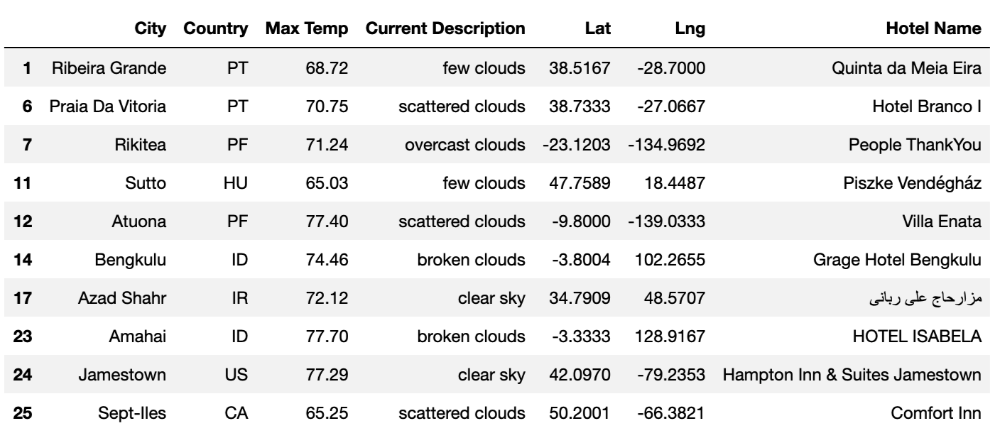
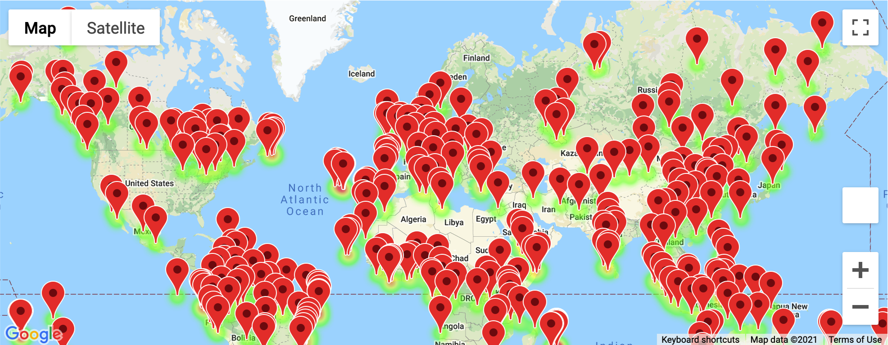
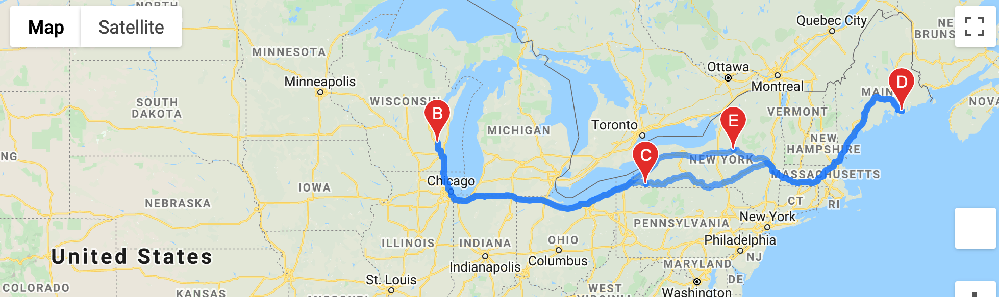
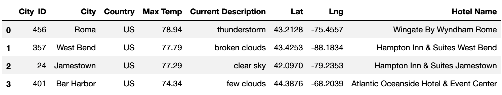
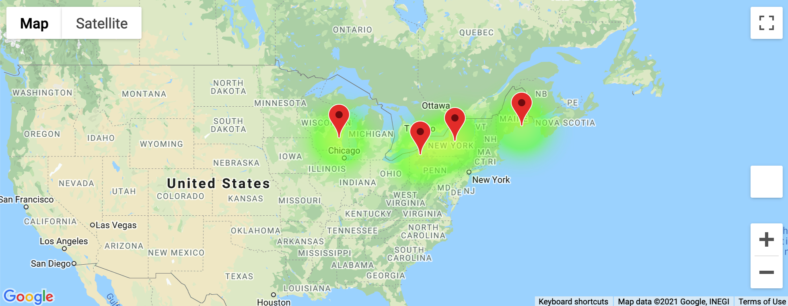

# World Weather Analysis with APIs

## Overview of Project

* PlanMyTrip, a top travel technology company, specializes in Internet services in the hotel and lodging industry
* Jack, the head of analysis for the user interface team, needs help collecting and presenting data for customers
* Customers will filter the data to find their vacation spot

### Additional Overview
* Currently, beta testers are using the PlanMyTrip app to examine its utility
* The app should return the proper information to the beta testers

### Purpose

* Retrieve weather data to present to beta testers 
* After the beta tester filters the weather data for his/her preferences, identify potential travel destinations and nearby hotels 
* After the beta tester chooses four cities, create a travel route between the four cities as well as a marker layer map
* **Objective: Beta tester should see Travel Destinations Map and Travel Itinerary Map with pop-up markers based on his/her preferences** 

## Results

### Step 1: Retrieve Weather Data

1. Retrieve weather data from >500 random cities
2. Use an API call to obtain the data for each city 
3. Create a DataFrame to display weather data for each city 
4. Export the DataFrame to a CSV file named WeatherPy_Database.csv

* Example DataFrame with the first 10 cities displayed: 
* To view weather data retrieval: go to Weather_Database folder and view Weather_Database.ipynb
* To view weather data CSV file: go to Weather_Database folder and view WeatherPy_Database.csv

### Step 2: Customer Travel Destinations Map

1. Import weather data from WeatherPy_Database.csv
2. Prompt the user to enter preferences
3. Based on user preferences, filter the original DataFrame to create a new DataFrame 
4. Find nearby hotels for cities in the filtered DataFrame and then clean the DataFrame 
5. Export the DataFrame to a CSV file named WeatherPy_vacation.csv
6. Show the hotel destinations on a marker layer map with pop-up markers 

* Example of filtered and cleaned DataFrame: 
* Marker layer map with pop-up markers: 
* Note: To view pop-up markers, go to Vacation_Search folder and view the final cell on Vacation_Search.ipynb. Pop-up markers will reveal the hotel, city, country, and max temperature.  
* To view hotel destinations CSV file: go to Vacation_Search folder and view WeatherPy_vacation.csv 

### Step 3: Travel Itinerary Map

1. Import hotel information from WeatherPy_vacation.csv
2. Pick four cities to create a vacation itinerary route to travel between the four cities and create a DataFrame for each city 
3. Create a direction layer map
4. Combine the four city DataFrames into one DataFrame
5. Create a marker layer map with pop-up markers for each city on the itinerary 

* Direction layer map: 
* Itinerary DataFrame example: 
* Marker layer map with pop-up markers: 
* Note: To view pop-up markers, go to Vacation_Itinerary folder and view the final cell on Vacation_Itinerary.ipynb. Pop-up markers will reveal the hotel, city, country, and max temperature for the four selected cities. 

## Summary: Does the PlanMyTrip app meet its objective? 

* PlanMyTrip's app meets its objective if the code returns a Travel Destinations Map and Travel Itinerary Map with pop-up markers based on the beta tester's preferences.
* As long as the app meets its objective, PlanMyTrip's app is a success. Therefore, PlanMyTrip can release the app to real customers. 